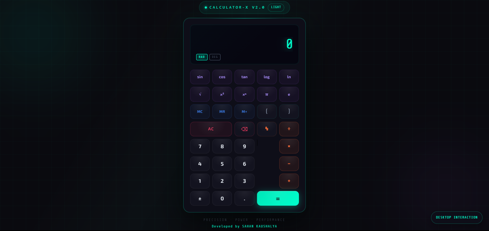
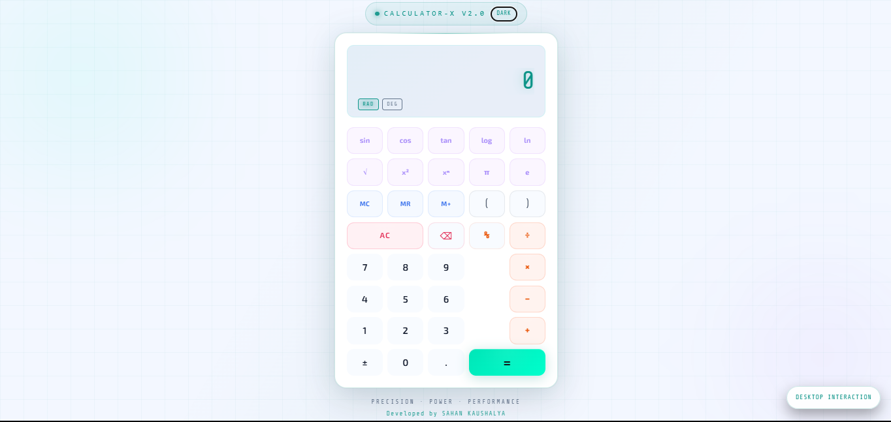
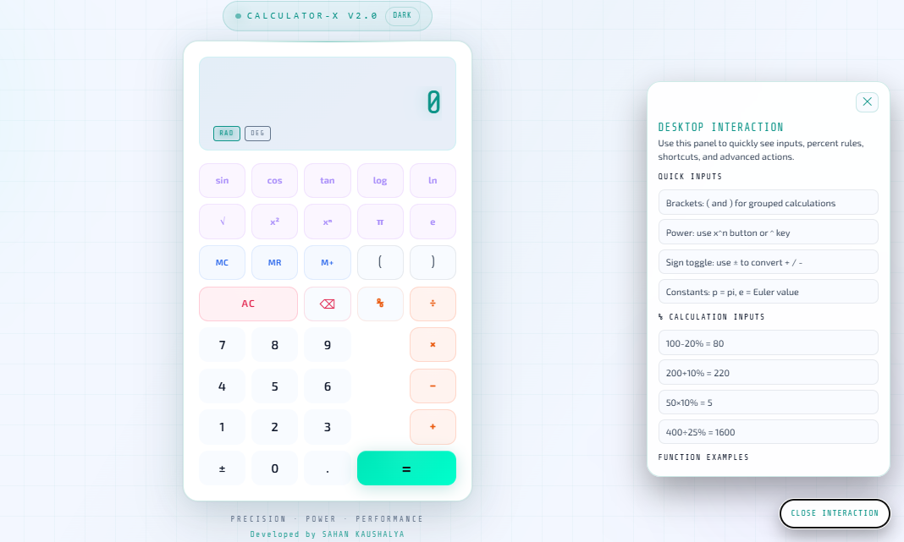
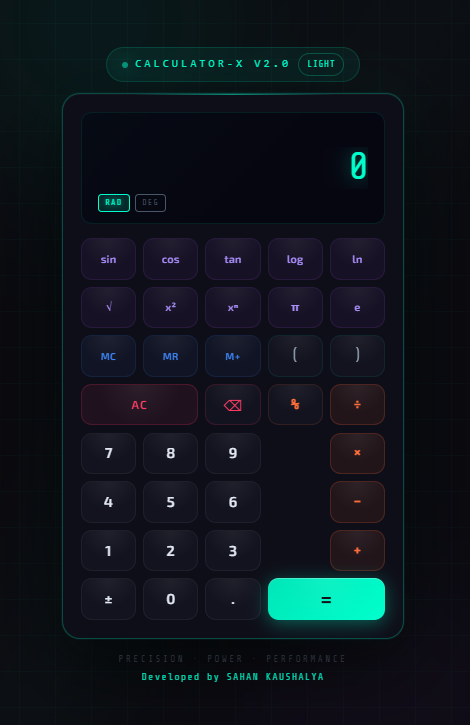
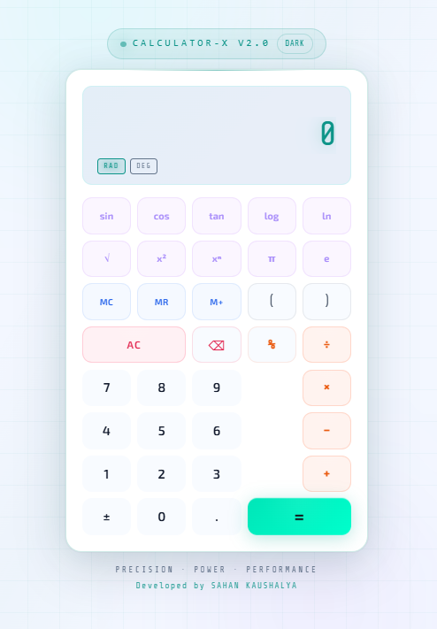

# Calculator X v2.0

A modern scientific calculator built with HTML, CSS, and JavaScript.

## Screenshots

### Dark Mode

### Light Mode

### Desktop Interaction Panel

### Mobile Dark Mode

### Mobile Light Mode

## Features

- Scientific operations: `sin`, `cos`, `tan`, `log`, `ln`, `sqrt`, `x²`, `xⁿ`
- Basic operations: add, subtract, multiply, divide
- Calculator-style percentage logic
  - `100 - 20% = 80`
  - `200 + 10% = 220`
  - `50 × 10% = 5`
- Memory functions: `MC`, `MR`, `M+`
- Parentheses and expression evaluation
- RAD/DEG mode switching for trigonometric functions
- Dark/Light theme toggle with saved preference
- Desktop interaction drawer (floating button, right-bottom)
- Keyboard and numpad support
- Responsive layout for desktop and mobile

## Project Structure

- `index.html` - UI structure
- `style.css` - Styling, themes, animations, responsive rules
- `calculator.js` - Calculator logic, keyboard handling, panel/theme behavior

## How to Run

1. Open the project folder.
2. Open `index.html` in your browser.

No build tools or package installation required.

## Keyboard Shortcuts

- Numbers: `0-9`
- Operators: `+ - * / %`
- Equals: `Enter` or `=`
- Delete last: `Backspace`
- Clear all: `Delete` or `Esc`
- Power: `^`
- Functions:
  - `s` = sin
  - `c` = cos
  - `t` = tan
  - `l` = log
  - `n` = ln
  - `r` = sqrt
  - `p` = pi
  - `e` = Euler constant

## Notes

- Percentage behavior follows standard calculator behavior (not modulo).
- The interaction drawer is visible on desktop and hidden on smaller screens.
